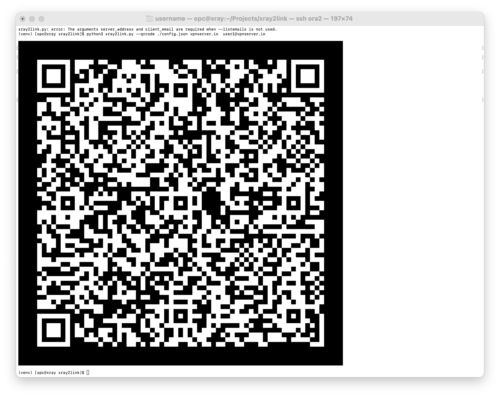

# xray2link

`xray2link` is a lightweight, command-line utility for [Xray-core](https://github.com/xtls/xray-core) server administrators. It parses your `config.json` file to quickly generate client share links (VLESS, VMess, Trojan) and display them as ASCII QR codes directly in your terminal.

This tool provides a simple, panel-free way to list all client emails and export their configurations, streamlining client management.

-----

## Features

  * **Generate Share Links:** Creates `vless://`, `vmess://`, and `trojan://` URLs.
  * **Find Clients by Email:** Locates clients based on their unique `email` field in the config.
  * **List All Clients:** Includes a flag (`--listemails`) to list all client emails found in your config.
  * **Terminal QR Codes:** Use the `--qrcode` flag to display the link as an ASCII QR code.
  * **Robust & Lightweight:** `pyqrcode` is an **optional** dependency. The script runs perfectly without it, just without the QR code feature.

-----

## Requirements

  * Python 3.6+
  * **For QR code support (Optional):**
    ```bash
    pip install pyqrcode
    ```

-----

## Usage

The script has two main modes: listing clients and generating links.

### 1\. List All Client Emails

To see a list of all client `email`s found in your configuration file:

```bash
python3 xray2link.py /etc/xray/config.json --listemails
```

**Example Output:**

```
Found client emails:
- client-1@email.com
- client-2@email.com
- client-3-trojan@email.com
```

### 2\. Generate a Share Link (Text)

To generate a standard URL string for a specific client, provide the config file, your server's address, and the client's email.

```bash
python3 xray2link.py /etc/xray/config.json my.domain.com client-1@email.com
```

**Example Output:**

```
vless://<your-uuid>@my.domain.com:443?type=tcp&security=xtls&flow=xtls-rprx-vision#client-1%40email.com
```

### 3\. Generate a Share Link (QR Code)

To display the share link as an ASCII QR code directly in your terminal, add the `--qrcode` flag.

**Note:** This requires `pyqrcode` to be installed. If it is not installed, the script will print a warning and fall back to displaying the text URL.

```bash
python3 xray2link.py /etc/xray/config.json my.domain.com client-1@email.com --qrcode
```

**Example Output:**




### 4\. Full Options

```
usage: xray2link.py [-h] [--listemails] [-qrcode]
                    config_file [server_address] [client_email]

Generate Xray share links or list client emails from config.json

positional arguments:
  config_file           Path to your server's config.json file
  server_address        Your server's public domain or IP (required for link generation)
  client_email          The 'email' of the client to generate a link for (required for link generation)

options:
  -h, --help            show this help message and exit
  --listemails          List all client emails found in the config and exit
  -qrcode, --qrcode     Print the share link as an ASCII QR code
                        (DISABLED: 'pyqrcode' module not found)
```

*Note: The "(DISABLED...)" message in the help text will only appear if `pyqrcode` is not installed.*

-----

## Supported Configurations

This script is designed to parse the standard Xray `config.json` format.

  * It finds clients by iterating through `inbounds`.
  * It supports `vless`, `vmess`, and `trojan` protocols.
  * It expects clients to be in a `clients` array within the inbound's `settings`.
  * It uses the `email` field as the unique identifier for clients.
  * It automatically detects stream settings like `ws`, `grpc`, `tls`, and `xtls` to build the correct URL parameters.

-----

## License

This project is licensed under the MIT License.
